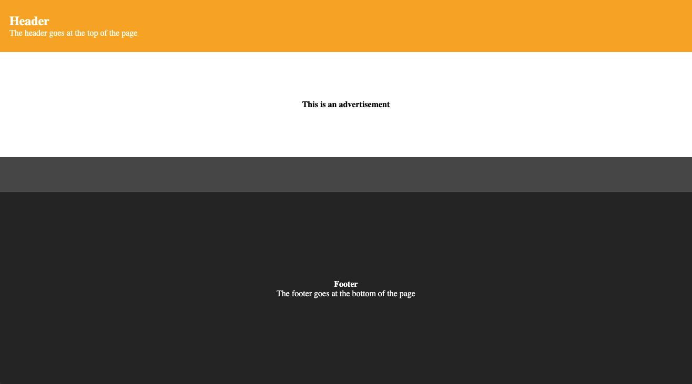

# css-position

## Learning Target
- I am learning how to use the CSS ```position``` property to control how elements are positioned

## Success Criteria
- I can set ```position``` to ```absolute```, ```relative```, ```fixed```, and ```sticky```
- I can identify the differences between ```static```, ```absolute```, ```relative```, ```fixed```, and ```sticky```
- I can use ```top```, ```left```, ```bottom```, and ```right``` with ```position``` properties to position an element


## Directions
1. Install Live Server and Go Live to view how the webpage looks with no styling
2. Follow directions below

## CSS Position Property
```css
selector {
    position: absolute | relative | fixed | sticky | static;
}
```
- ```absolute``` allows you to position the element relative to its container (The container must have ```position: relative``` or ```position: absolute``` set or it will be relative to the body element)
- ```relative``` allows you to position the element relative to where it normally would be
- ```fixed``` is like absolute except the element will not scroll - the element stays in a *fixed* position
- ```sticky``` allows you to specify the element to *stick* when the page is scrolled

To change the position of an element, you must also set ```top```, ```bottom```, ```left``` or ```right```
- ```top``` is how far from the top (```px```, ```%```, or any other CSS unit)
- ```bottom``` is how far from the bottom
- ```left``` is how far from the left
- ```right``` is how far from the right

**NOTE:** You *CAN* combine ```top``` and ```left```, ```top``` and ```right```, etc., but you *CANNOT* use both ```top``` and ```bottom``` or ```left``` and ```right```

## Assignment
1. Open ```assignment.html``` in your browser and ```assignment.css``` in your editor.
2. Find the ```.header``` selector and use ```postion``` and ```top``` so that the header will be fixed to the top of the screen
3. Find the ```.nav``` selector and use ```position```, ```top```, and ```right``` so the nav will be positioned on the right, halfway down, but still scroll up/down
4. Find the ```.ad``` selector and use ```position``` and ```top``` so that the ad will stick underneath the header when scrolled up

**Refer to the screenshots below to see how it should look**

### Normal (not scrolled)


### Partially scrolled


### Scrolled all the way down

